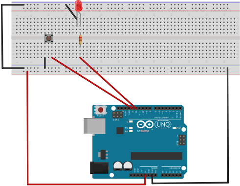
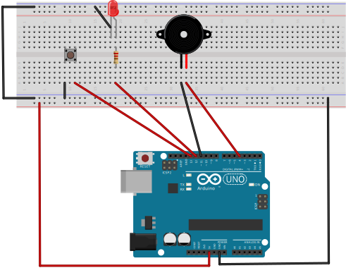
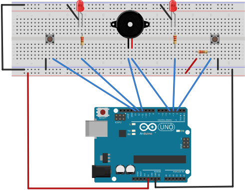

# First example
==============

[Back to README.md](README.md)

## Hello world: make a LED blink

> Because we always have to do our first step :)

The first example is the default hello world in a hardware world, which means that your first goal is make a LED turn on and blink.

Fritzing diagram: [assets/led.fzz](assets/led.fzz)

### Challenges

- First contact with `johnny-five` package;
- Start using `johnny-five` events;
- Start using `johnny-five` components;
- First sensor integration and interaction;
- First contact with jumper wires;

### Experiments

- How to change the blink time?

# Second example
==============

## Click the button, turn on the lights: magic happens!

> Because we always can make it better!

The second example is based on the first one, but now you need to integrate a new component in the game. The main idea here is turn on the light in your LED when you click the button and turn off the LED light when you release the button.

Fritzing diagram: [assets/led-button.fzz](assets/led-button.fzz)

### Challenges

- Start using `johnny-five` button class;
- First contact with resistors;
- First integration and interaction with physical buttons;
- Understand how to make communication between different components;

### Experiments

- How to change the order of the commands. EX: turn on the LED by default and turn off when the button is clicked?

# Third example
==============

## Turn on the lights + beep when​ a button is clicked

> Let me introduce a new friend called `Piezo`, but his nickname is `Buzzer`

In the third example you will know a new component called piezo/buzzer and add another user iteraction in your game. When you click the button, you need to turn on the LED and make the piezo emit a sound and when you release the button you should turn off the LED and stop the piezo song.

Fritzing diagram: [assets/led-button-piezo.fzz](assets/led-button-piezo.fzz)

### Challenges

- Start using `johnny-five` piezo class;
- How to organize jumpers in the breadboard;
- First integration and interaction with piezo and how to change the sounds;

### Experiments

- How to add this integration for each button and LED?
- How to make a piezo emit a different sound?

# Forth example
==============

## Simon game: make a LED blink

> And right now, I want to play a memory game with you :)

In the last step you should make a simon game using all the concepts which you are learning. The main goal is integrate the components in the downloaded javascript template. We have some questions, such as:

- How can I turn on a specific LED?
- How can I turn off LEDS and Piezo?
- How to start the game again, if user pressed the wrong button?

Fritzing diagram: [assets/memory-game.fzz](assets/memory-game.fzz)

PS:
** Yes, they are the same components as the third example;
*** We already have the template file. So that we can keep focusing in the game integration steps
**** In this step, you already know everything you want 

### Challenges

- Start integration between different components;
- Manage behaviours in different components;
- Reuse ground integration for components;

[Back to README.md](README.md)
